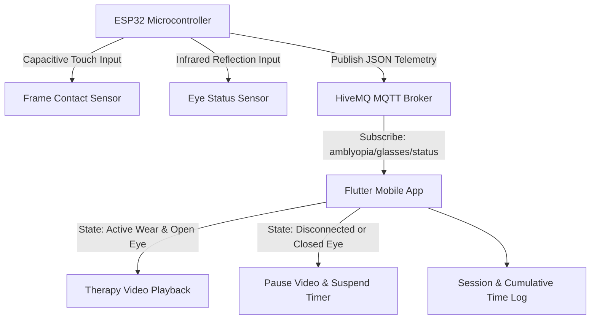

# LazEye Track: Smart Amblyopia Therapy Compliance System

[](https://flutter.dev/)
[](https://dart.dev/)
[](https://www.espressif.com/)
[](https://mqtt.org/)
[](LICENSE)

LazEye Track is an IoT-enabled smart glasses monitoring framework and companion mobile application designed to quantify and enforce pediatric treatment compliance for Amblyopia (Lazy Eye). 

The system integrates capacitive touch frame-detection sensors and infrared eye-openness sensors on an ESP32 microcontroller with a Flutter application. By coupling real-time telemetry over MQTT with positive reinforcement video playback (playback active only during verified spectacle wear and eye openness), LazEye Track provides objective clinical adherence telemetry at low hardware cost.

---

## Clinical Background & Problem Statement

Amblyopia affects an estimated 5 million children in India and over 28 million globally. Traditional occlusion (patching) and refractive correction therapies exhibit significant non-compliance rates:

* **Occlusion Therapy Non-Compliance:** 11.7% to 54.0% (*Searle et al.*)
* **Spectacle Adherence Non-Compliance:** 44.0% to 56.0% (*Infant Aphakia Treatment Study*)

### Key Clinical Deficiencies Addressed:
1. **Lack of Objective Monitoring:** Clinical compliance relies primarily on qualitative parental self-reporting, introducing memory and desirability bias.
2. **Pediatric Non-Adherence:** Discomfort and social stigma lead to unmonitored removal of therapeutic spectacles/patches.
3. **High Equipment Costs:** Existing commercial digital tracking solutions range between ₹1,20,000 and ₹1,50,000 ($1,500 - $1,800 USD), creating high economic barriers to adoption.

---

## System Architecture



### Therapy Control Logic
Therapy session tracking and media reinforcement are conditionally governed:

$$\text{TherapyActive} = \text{FrameContact} \land \text{EyeOpen}$$

- **`FrameContact`**: Evaluated as `true` when capacitive skin contact on the spectacle frame exceeds baseline thresholds (`worn`, `contact`, `1`, `true`).
- **`EyeOpen`**: Evaluated as `true` when infrared reflection confirms presence and ocular openness (`open`, `detected`, `present`, `1`, `true`).

If `TherapyActive` evaluates to `true`, positive reinforcement media plays continuously and session timers increment. If either state returns `false`, media pauses immediately and active session timing halts.

---

## Hardware Specifications & Cost Breakdown

| Component | Description / Part | Purpose | Unit Cost (INR) |
| :--- | :--- | :--- | :--- |
| **Microcontroller** | ESP32-WROOM-32 | Processing unit, Wi-Fi stack, and MQTT client | ₹500 |
| **Frame Sensor** | TTP223 Capacitive Touch Module | Detects frame contact with temple/nasal skin | ₹12 |
| **Ocular Sensor** | Active Infrared (IR) Sensor Module | Detects ocular presence and anterior eye reflection | ₹45 |
| **System Total** | **Integrated Wearable Telemetry Assembly** | **Affordable clinical adherence hardware** | **~ ₹600 (~$7.50 USD)** |

---

## Telemetry Protocol (MQTT)

The hardware module transmits telemetry events to an MQTT broker over TCP.

- **Broker Host:** `broker.hivemq.com`
- **Port:** `1883` (Default MQTT)
- **Publish Topic:** `amblyopia/glasses/status`
- **Publish Interval:** 1000 ms

### JSON Payload Schema
```json
{
  "frame_contact": "worn",
  "eye_status": "open",
  "system_state": "THERAPY_ACTIVE"
}
```

---

## Repository Structure

```text
LazEye-Track/
├── assets/
│   └── videos/
│       └── therapy.mp4           # Video asset for positive reinforcement therapy
├── firmware/
│   └── esp32_smart_glasses.ino   # ESP32 firmware (Wi-Fi, sensor sampling, MQTT client)
├── lib/
│   ├── main.dart                 # Application entry point, dashboard UI, state logic
│   ├── mqtt_service.dart          # MQTT client service and JSON message decoder
│   └── video_player_widget.dart   # Conditional media player widget
├── pubspec.yaml                  # Project dependencies and asset definitions
└── README.md                     # Technical documentation
```

---

## Deployment & Setup

### Requirements
- **Flutter SDK:** `>= 3.0.0 < 4.0.0`
- **Dart SDK:** `>= 3.0.0`
- **Arduino IDE / PlatformIO:** (For flashing ESP32 microcontroller)

### Mobile Application Installation
1. Clone the repository:
   ```bash
   git clone https://github.com/adithya-chakravarthi-02/LazEye_Track_Official.git
   cd LazEye-Track
   ```
2. Place a valid therapy video file at `assets/videos/therapy.mp4`.
3. Fetch Flutter dependencies:
   ```bash
   flutter pub get
   ```
4. Run the application:
   ```bash
   flutter run
   ```

### Firmware Flashing
1. Open `firmware/esp32_smart_glasses.ino` in Arduino IDE or PlatformIO.
2. Install the required libraries: `PubSubClient`, `ArduinoJson`.
3. Configure Wi-Fi SSID and Password parameters in the sketch.
4. Select board target `ESP32 Dev Module` and flash via USB serial.

---

## Future Clinical Extensions

- **Closed-Loop LCD Shuttering:** Direct hardware-based occlusion modulation driven by adherence telemetry.
- **Clinician Cloud Portal:** Synchronized longitudinal adherence logs and compliance reporting for pediatric ophthalmologists.
- **Blink Dynamics Monitoring:** Ocular fatigue analysis and blink frequency evaluation to assist in dry-eye risk mitigation.

---

## License

This project is licensed under the MIT License. See the [LICENSE](LICENSE) file for details.
